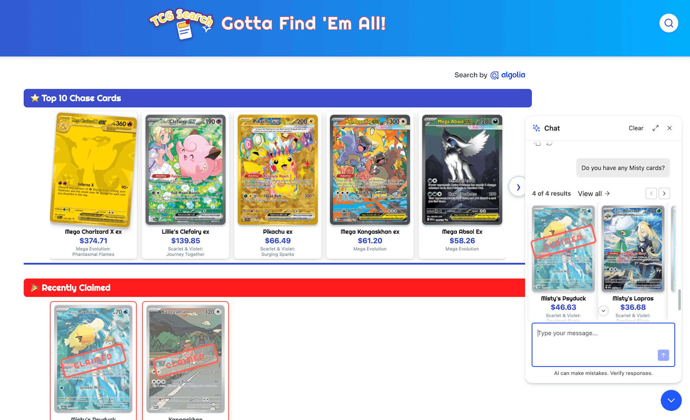
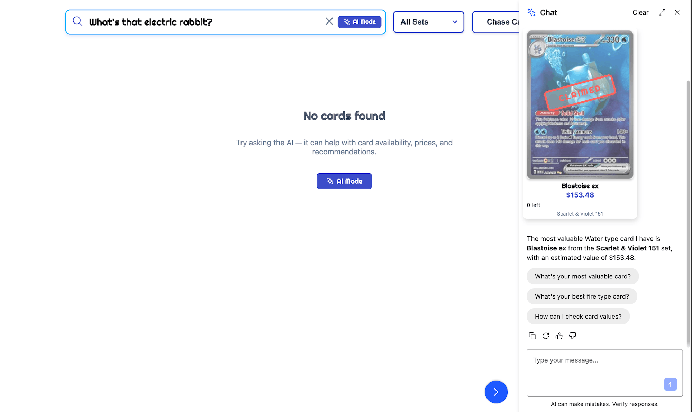
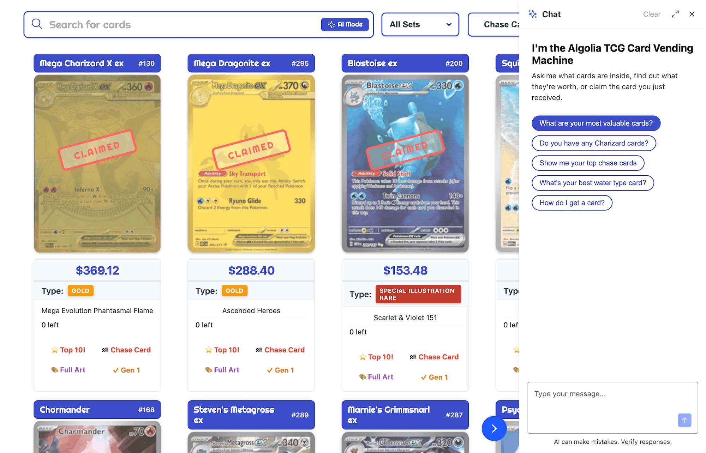

## Your agent is so 2025

At conferences, Algolia runs a demo where attendees pull a collectible trading card from an actual vending machine, then use a kiosk app I wrote to claim the card and discover its value. It's been very popular with developers!

Last November I shipped v1 of this kiosk with an agent component built on Algolia Agent Studio and the InstantSearch `<Chat>` widget. It worked, but the integration had a fundamental design problem. The chat lived in the bottom corner of the page and was a separate experience from the rest of the user interface (UI). This meant users had to scroll down to find it, leave the search UI to use it, then navigate back when they were done.



For v2, I wanted to make search and chat feel like one retrieval interface: keyword search when the query is precise, AI when the user's intent is broader, and a clean handoff between the two. Fortunately, since November both Agent Studio and InstantSearch have shipped features that make this easier.

In this post I'll walk you through that integration process and show you where Algolia's libraries provide the pieces, and where the seams still show.

---

## Wait, what is Agent Studio?

If you're not familiar, Agent Studio is Algolia's platform for building hosted conversational AI experiences grounded in your search data. You configure an agent made up of a system prompt, an LLM provider, and Algolia indices it can query. It answers questions by actually searching your live data rather than relying solely on model training. You can then layer in additional tools, memory, LLM guardrails, and all the other things you'd expect in a modern agent. There's a [quickstart](https://algolia.com/doc/guides/algolia-ai/agent-studio/how-to/quickstart) to walk you through setting one up from scratch.

Once I had the agent configured the way I wanted it, I added it to my application using the `<Chat>` widget that ships as part of `react-instantsearch` and lives inside the same `InstantSearch` tree as the search UI widgets. Both experiences share the same search client, the same index, and the same rendering context. That shared foundation is what makes a real integration possible.

---

## The v1 Gap: Two experiences, no connection

Thanks to Agent Studio, my original app shipped with a working chatbot. If you asked it a question about the trading cards, the agent would search the index and use the results to craft the response. What it didn't have was any connection to the search interface:

- No UI affordance linking the search box to the chat — users had to scroll to find the embedded widget
- No way to pre-load the chat with a query that was already in the search box
- No path from a zero-results search back to the conversational agent
- No way to bring agent-recommended cards back into the faceted search surface
- No handling for users who typed natural language questions into the search box and got zero results

Basically, the app had two separate experiences that happened to share a webpage. Fixing that meant building the handoff between them.

---

## The Agent as a retrieval tool

The big conceptual shift here is thinking about the agent as a second retrieval mode for your index, not as a chatbot that happens to search. The flag that locks this in is one line of agent config:

```json
"config": { "enableAlgoliaMcp": true }
```

This swaps the agent's search behavior over to Algolia's [Public MCP](https://www.algolia.com/doc/guides/model-context-protocol/public-mcp). The change is invisible at the config level. Same indices, same agent prompt, same UI. What changes is what the agent actually sees when it goes to search. In new agents, you get this by default, but for older agents like mine, you have to turn it on. 

Before MCP, the agent talked to a single generic `algolia_search_index` tool. That tool took a query, optional filters, and pagination. That's the whole interface. Anything you wanted the agent to know about your data — what's filterable, what facet values exist, what the price range is, when to sort one way versus another — had to live in your prompt. The agent treated your index as an opaque search endpoint and you're on the hook for teaching it what's behind that endpoint.

With MCP enabled, the picture gets a lot richer. The agent gets a separate search tool per index, plus a shared facet-values lookup. For my trading card app that's four tools total:

- `algolia_search_index_tcg_cards_event-2026`
- `algolia_search_index_tcg_cards_event-2026_price_asc`
- `algolia_search_index_tcg_cards_event-2026_price_desc`
- `algolia_search_for_facet_values`

Each search tool comes with its own description and its own input schema. And those descriptions and schemas are dense! Much denser than a hand-written tool spec usually is, because Algolia generates them automatically from your index's metadata using an LLM.

Here's a slice of what the agent sees for the primary index, paraphrased from the actual MCP tool definition:

> About this index:
> - 1 record = 1 Pokémon trading card entry.
> - Industry: Collectibles, specifically trading card games.
> - Who would use this index: Collectors, retailers, inventory managers.
> - Most relevant attributes:
>     - `pokemon_name` (searchable)
>     - `card_type` (searchable/filterable)
>     - `estimated_value` (filterable)
>     - `is_chase_card` (filterable)
>     - `is_full_art` (filterable)
>     - `set_name` (searchable/filterable)
>     - `pokemon_types` (searchable/filterable)
> - `pokemon_types` is multi-valued.

That's a semantic description of the index, generated at index-publish time. The agent reads this before it processes a single user query. It already knows what a record is, which attributes are filterable, which are multi-valued.

The input schema gets even more specific. Each facet filter parameter carries its own description, with example values from my data. That's the part that really matters. The MCP layer gives your agent the kind of structured introspection you get from the Algolia dashboard. The list of facet values, the data ranges, the searchable/filterable annotations — MCP routes that knowledge into the agent's tool definitions instead of asking you to redescribe it in the prompt. The agent loads them once when the session opens. The system prompt stays focused on what the agent should *do*, not what's in your index.

The per-index split also pays off concretely for the price sorts. "What's the cheapest Psychic card?" pushes the agent toward the virtual replica, because that tool's description says it's sorted by price ascending. "Most valuable card in the machine right now?" goes to `price_desc`. The agent picks the right replica by reading the tool descriptions.

**The concrete payoff.** I deleted several lines of system prompt that walked the agent through these exact cases: how to construct empty-query facet searches, which sort to use for which question, what the facet values were. The MCP-backed tools carry that context themselves now. My prompt got shorter and my answers got more reliable on the same model.

---

## Chat + Search: The easy parts

With the agent configured as a retrieval mode, the rest was frontend wiring: search box to chat, zero results to AI, chat results back to search. Fortunately, the InstantSearch folks have been keeping up with these same trends and most of these features turned out to already exist as properties within the updated `<Chat>` widget.

**AI Mode: the search box becomes the entry point to both retrieval modes.**

`aiMode` adds an "Ask AI" button inside the search field. When clicked, it takes the current query and opens the Chat widget with it pre-loaded. A user who searches for "valuable cards" and doesn't find what they want can tap one button and arrive in a chat context with their search already as the opening prompt.

```jsx
<SearchBox placeholder="Search for cards" aiMode />
```

One heads-up: if your search box already has custom styling, budget a CSS session — the AI Mode button renders as a flex sibling inside the form rather than inside the input, which may break some styling assumptions you've made (it did for me). 

**Side panel layout: chat opens without leaving the search context.**

`ChatSidePanelLayout` opens the chat as a slide-in panel from the right edge of the page. Critically, it shifts the page content left rather than overlapping it — the search results stay visible while the conversation happens. The two surfaces are in dialogue rather than mutually exclusive. This feels much more coherent than a pop-up chat modal.

```jsx
import { Chat, ChatSidePanelLayout } from 'react-instantsearch';

<Chat agentId={agentId} layoutComponent={ChatSidePanelLayout} />
```

**Chat greeting: sets the expectation of a search assistant, not a general chatbot.**

`ChatGreeting` renders when the chat has no messages. What it says matters — a greeting that positions the agent as a search assistant is different from a generic "How can I help you?" The library's component handles a heading, subheading, and banner image, passed in via `emptyComponent`. For my case I wanted clickable starter prompts in the greeting too, which meant going off the library path. More on that in the seams below.

**Feedback: closes the loop on retrieval quality.**

The widget can also include a thumbs up/down on every assistant message, wired to the Agent Studio feedback API by including the prop `feedback`. This is an opt-in because it requires the widget to sign requests with the search client's credentials. This provides feedback into agent interactions to match the existing keyword analytics.

Things are moving quickly here. The library has shipped more of this integration layer than the docs surface, so keep an eye on the package exports before building any of these connections from scratch.

---

## The remaining seams

As I was building v2, a few handoff moments don't yet have clean library-level solutions.

**Enter should open the chat.** Search-as-you-type runs on every keystroke — form submission is a dead end. But pressing Enter with a non-empty query is a natural gesture on any interface with a conversational agent. `SearchBox` exposes an `onSubmit` prop, but there's no `openChat` callback — the AI Mode button's click handler is wired internally to Chat's `setOpen` and not exposed. The workaround is a DOM query on `.ais-AiModeButton` via `onSubmit`, reading the current query from `useSearchBox` since the submit event doesn't carry it. Fragile, but the button is always mounted when `aiMode` and `Chat` are in the tree, so it holds.

**The no-results state is the most important handoff point.** When a natural language question returns zero results, "try adjusting your search or filters" is the wrong advice. The search engine isn't broken — it's just the wrong retrieval mode for that query. The right response is to acknowledge the mode switch:

> No cards found. Try asking the AI — it can answer questions about availability, prices, and recommendations.

With a button that opens the chat with the current query pre-loaded. This is where keyword search fails and conversational search takes over — it should feel like a hand-off, not a dead end.



There was one complication: `AiModeButton` isn't exported as a standalone component. For the no-results state and anywhere else you need a chat entry point outside the search box, extract the sparkle SVG from the InstantSearch source and build a thin wrapper. Small maintenance surface.

**`ChatGreeting` doesn't expose interactive hooks.** As I mentioned above, the library's `ChatGreeting` component accepts a heading, subheading, and banner image, but no slot for buttons or other clickable content. I wanted starter prompts in the empty state — a handful of things like "Show me your top chase cards" buttons that would seed the conversation. To get them, I skipped the library's component entirely and passed a custom function as `emptyComponent`. The widget calls that function with a `sendMessage` prop, which is the piece that does the work — clicking a chip just calls `sendMessage({ text: prompt })`. Keeping the `ais-ChatGreeting` class names on the wrapper meant the existing CSS still applied:

```jsx
const PROMPT_SUGGESTIONS = [
  'What are your most valuable cards?',
  'Show me your top chase cards',
  "What's your best water type card?",
  'How do I get a card?',
];

function ChatGreeting({ sendMessage }) {
  return (
    <div className="ais-ChatGreeting">
      <h2 className="ais-ChatGreeting-heading">I&apos;m the Algolia TCG Card Vending Machine</h2>
      <p className="ais-ChatGreeting-subheading">Ask me what cards are inside…</p>
      <div className="chat-greeting-suggestions">
        {PROMPT_SUGGESTIONS.map((prompt) => (
          <button key={prompt} type="button" className="chat-greeting-suggestion"
            onClick={() => sendMessage({ text: prompt })}>
            {prompt}
          </button>
        ))}
      </div>
    </div>
  );
}
```



Small and self-contained, but worth noting that "interactive empty state" isn't part of the library's greeting API yet.

These are workarounds and I suspect the InstantSearch component will soon catch up. The most important one to ship is the no-results handoff — that's the moment the two retrieval modes need each other most.

---

## The "View All" regression

A few weeks after shipping the MCP integration, a bug appeared: clicking "View all" in the chat showed unfiltered results for facet-based queries ("show me Psychic type full art cards") but worked correctly for keyword queries. The behavior had been working before.

"View All" is the return path from chat back to the search results surface — the completion of the loop: search → chat → search. When it broke, it broke exactly at the Agent Studio / InstantSearch seam.

The root cause was a schema mismatch: the MCP layer changed how facet filters are represented in the tool payload, and `connectChat`'s `applyFilters` was written against the old shape. The search fired with no facets applied, no error, just wrong results. The fix is landing in react-instantsearch 7.36; until then a small handler in our app reads the agent's tool payload and translates it before applying.

The broader lesson matters regardless of the specific bug: **enabling the MCP in Agent Studio can change the shape of data that InstantSearch widgets consume.** Any UI that reads the search tool output — "View All" buttons, filter breadcrumbs, active state indicators — needs testing after any Agent Studio configuration change, not just the chat widget itself.

---

## Where v2 landed 

My v2 app launched as a single retrieval interface with two modes. The search box became the entry point to both. Keyword search handles structured queries; the agent handles intent that doesn't map cleanly to index attributes. When keyword search fails, the no-results state hands off to chat. When chat finds something, "View All" brings it back to the faceted search surface. The same index powers both.

What that feels like in front of a conference attendee is the part I'm most excited about. Someone who types "psychic type full art" and gets zero results no longer hits a dead end — they tap one button and the agent picks up exactly where the search left off. Someone who asks "what's the most valuable card in the machine right now?" gets an answer the keyword index could never produce, and "View All" puts those cards into the faceted surface so they can keep exploring. The user never has to think about which mode they're in. They ask, and the right tool answers.

The v1 version shared data but not an experience. This one shares both.

The seams that remain are the texture of integration work at a product boundary that's still being built. Some are bugs and will close in the next release. Others are conventions that haven't been written yet — an exported `AiModeButton`, an `openChat` callback, a cleaner bridge from form submission into the chat. They'll come.

You can see v2 in action on [this demo site](https://algolia-tcg-search.vercel.app/foo-nyc-2026).

---

## Your challenge

If your product has both a chat experience and a search box, here's my challenge to you: make them coexist.

Watch a real user move between them. Do they feel like one retrieval interface with two modes, or two features that happen to share a page? When keyword search comes up empty, does chat pick up the thread — or does the user start over somewhere else? When chat surfaces something interesting, is there a path back into your structured results, or does the conversation end as a dead end?

The specific tools in this post are Agent Studio and InstantSearch, but the pattern travels: chat and search are two modes of the same job. Treating them as one experience changes what your users can actually do.
