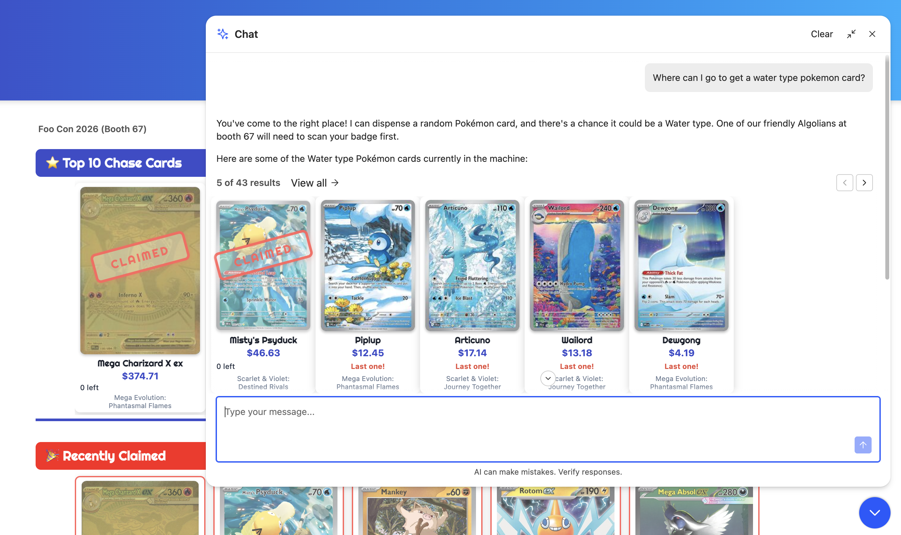
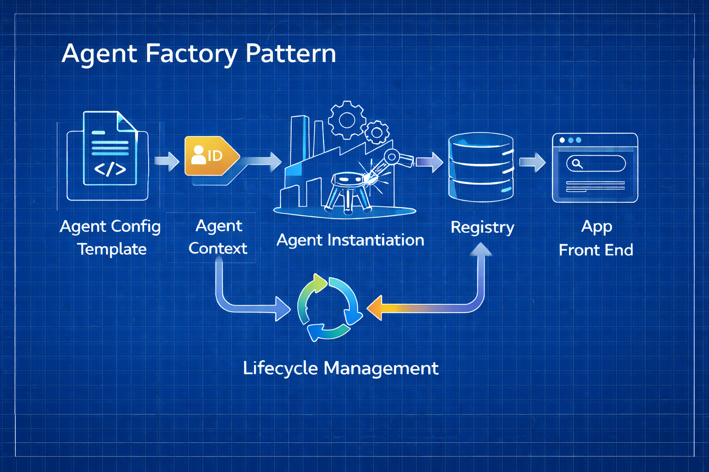

Agents are suddenly everywhere. But deploying the same agent to multiple events, customers, or product lines is harder than it looks. How do you make sure every instance has the right configuration? And when something improves, how do you propagate it without touching each one by hand?

I developed the Agent Factory pattern while scaling a conference demo from one event to many. This post covers the pattern — and how to apply it to any project where agents need to be deployed consistently across multiple contexts.

---

## The Three-Legged Stool

Before describing the pattern, it helps to be precise about what an agent actually is. Strip away the API surface and every agent is built from three things:

**Model** — the LLM provider and model name. This is the reasoning engine. It determines response quality, context window, and cost per query.

**Tools** — what the agent can do. For an Algolia-backed agent, this is typically an `algolia_search_index` tool pointing at one or more indices. 

**Prompt** — the system instructions that shape how the agent behaves: its role, its tone, its constraints, and critically, how it should use its tools. This is where domain knowledge lives.

Typically in agent frameworks all three legs are configured at creation time. That's what makes agents predictable and auditable. But it also means that when you need the same agent experience across multiple contexts, each context needs its own correctly-configured instance. At meaningful scale, managing that by hand doesn't hold up.

---

## When One Stool Isn't Enough

Recently, I used [Algolia's Agent Studio](https://www.algolia.com/doc/guides/algolia-ai/agent-studio) to build a demo application for use at Algolia's conference booths. Attendees chat with an AI agent to check Pokemon card values. The agent retrieves all of the underlying data from a searchable index using an MCP-like tool.



Each conference gets a fresh set of cards. All three legs of the stool need to adapt: the **tool** must point at that event's searchable index. The **prompt** must reference the right event name, booth number, and context. Even the underlying **model** might change based on cost or event context (I should probably steer clear of Gemini models at an AWS event!).

At first, I considered a single agent with tool access to every event's index. But a shared agent has no way to know which event it's at, so it can't scope its searches or tailor its responses to the right context. It either searches everything indiscriminately or requires guardrails I couldn't enforce. 

One agent per event was the only way to maintain scope. But how to keep them all consistent?

---

## The Factory Pattern

The answer is to treat agent creation as a repeatable process: define the three legs as a templates, render them together with each new context, register the resulting agent ID, and manage the fleet as a unit. The diagram below shows how those pieces fit together. I call this the Agent Factory pattern.



### One Template, Three Legs

The model, tools, and prompt all reference the same context — if you render them separately, they can drift. The solution is to store everything as templates with shared placeholder variables and render all three legs together in a single pass at creation time:

**`agent-config.json`**
```json
{
  "name": "Demo Agent — {{event_name}}",
  "provider": "your-llm-provider",
  "model": "your-model",
  "instructions": "PROMPT.md",
  "tools": [
    {
      "type": "algolia_index_search",
      "index": "catalog_{{event_id}}",
      "description": "Product catalog for the {{event_name}} event."
    }
  ]
}
```

**`PROMPT.md`** (excerpt)
```markdown
You are an agent at {{event_name}} (booth {{booth}}).
Use Algolia search to help attendees find cards in the vending machine.
```

`{{event_id}}`, `{{event_name}}`, and `{{booth}}` are resolved across both files together. A missing or mismatched variable fails before any API call is made. When the prompt improves or the tool configuration changes, both are updated atomically.

### Registering What Was Built

Agent Studio exposes each agent as a managed endpoint with a unique ID returned at creation time. The ID isn't predictable in advance, so the factory writes it back to an event registry the application reads at runtime. This registry could be a database, a config file, or in our case, an Algolia index.

### Managing the Fleet

Agent creation is only the beginning. When the prompt changes or new models drop, existing agents need to be updated. When an event is retired, its agent should be deleted. The factory exposes the full lifecycle:

```bash
# New event
python agent.py create shoptalk-2026 "Shoptalk 2026" 701 --publish

# Prompt improvement — preview then push to all existing agents
python agent.py update --all --dry-run
python agent.py update --all --publish

# Retire an event
python agent.py delete etail-palm-springs-2026
```

The `update --all` is the beating heart of the factory. One command re-renders the current templates against every event that has an agent. A prompt improvement or tool fix is now one command rather than N error-prone dashboard edits. Storing configuration as files rather than dashboard state means you can version, diff, and roll back changes like any other code.

---

## Codifying the Factory

As the factory matured, a clear split emerged: generic Agent Studio API logic on one side, demo-specific domain logic on the other. I extracted the generic layer into a standalone open-source CLI — [`algolia-agent`](https://github.com/algolia-samples/algolia-agent-cli) — so the pattern is reusable beyond this project.

```bash
algolia-agent init        # defines all three parts of your agent interactively
algolia-agent create      # renders templates and calls the API
algolia-agent update      # diffs and pushes changes to existing agents
algolia-agent publish     # promotes a draft to live
```

---

## The Pattern in Action

A user at the booth asked: *"Do you have any cards worth more than $50?"*

With no guidance on numeric filters, the agent searched for "cards worth more than 50 dollars" as a keyword query — matching card descriptions that mentioned the word "worth," not cards filtered by actual value.

The fix was one line in the prompt:

```markdown
For "more than" / "less than" questions on
numeric fields, use comparison operators in
searchParams filters rather than facets:
e.g.
    `searchParams: { filters: 'estimated_value > 50' }`
```

Before pushing to the fleet, I used `--dry-run` to preview the rendered configuration before any API call was made. A wrong change pushed to N agents is N times harder to debug than one caught before deployment.

Since I was running agents for multiple active events, one `update --all` pushed the improvement to every instance simultaneously. That's the payoff of treating the prompt as a versioned artifact and the fleet as a unit.

---

## Conclusion

Building an agent demo that needed to scale across conference events forced me to think carefully about what an agent actually is. Strip it down and you get three legs: a model, a set of tools, and a prompt. Once I had that definition, it was easy to separate what was core agent configuration from what was event-specific context.

The factory pattern helped me formalize that separation into something repeatable: scaffold the agent definition, render it for each context, perform consistent CRUD operations across every instance. When something improves — a better prompt, a model upgrade, a tool fix — one command propagates it to every agent at once.

Feel free to try out my [`algolia-agent`](https://github.com/algolia-samples/algolia-agent-cli) for yourself. I'd also love to hear if the factory pattern is useful to you, or how it can be improved!
